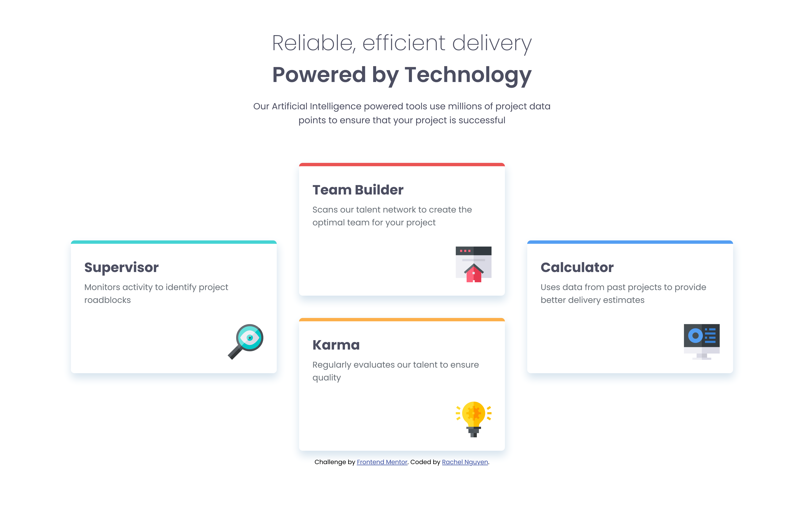
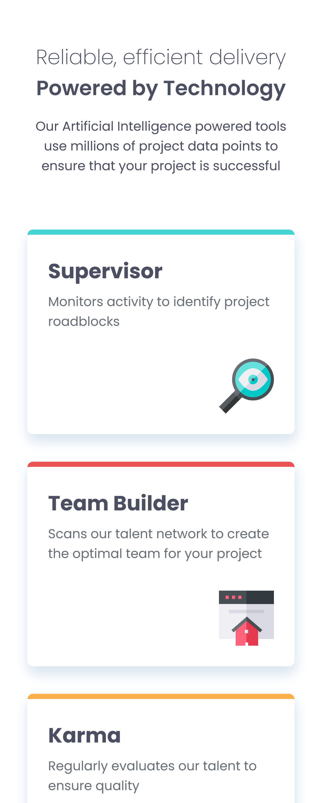

# Frontend Mentor - Four card feature section solution

This is a solution to the [Four card feature section challenge on Frontend Mentor](https://www.frontendmentor.io/challenges/four-card-feature-section-weK1eFYK). Frontend Mentor challenges help you improve your coding skills by building realistic projects. 

## Table of contents

- [Overview](#overview)
  - [The challenge](#the-challenge)
  - [Screenshot](#screenshot)
  - [Links](#links)
- [My process](#my-process)
  - [Built with](#built-with)
  - [What I learned](#what-i-learned)
  - [Continued development](#continued-development)
  - [Useful resources](#useful-resources)
- [Author](#author)

## Overview

### The challenge

Users should be able to:

- View the optimal layout for the site depending on their device's screen size

### Screenshots




### Links

- Solution URL: https://github.com/rangusun/FourCardFeatureSection
- Live Site URL: [Add live site URL here](https://your-live-site-url.com)

## My process

### Built with

- Semantic HTML5 markup
- CSS custom properties
- Flexbox
- CSS Grid
- Mobile-first workflow

### What I learned

For this project, I decided to use the layout system I have never used before, CSS Grid, for creating the desktop layout. It was a little difficult to understand at first but after practicing and experimenting I started to learn how to utilize it for this project. I found that it made it easy to create the four card layout by establishing the grid system and then assigning the cards to the appropriate positions. With CSS Grid giving you fine control with grid areas and assigning elements to these areas, it helped simplify the development process and code in creating the complex and responsive layout.

```css
.card-grid {
    max-width: 1250px;
    margin: 0 auto;
    padding: 0 2rem;

    display: grid;
    gap: 2.5rem;
    grid-template-columns: repeat(3, 1fr);
    grid-template-areas: 
    '. two .'
    'one two four'
    'one three four'
    '. three .';
}

.section-one {
    grid-area: one;
}
.section-two {
    grid-area: two;
}
.section-three {
    grid-area: three;
}
.section-four {
    grid-area: four;
}
```

### Continued development

After learning and using CSS Grid, I found that it is an interesting framework to use for complex or strict layouts. I would like to continue to learn more and use it in future projects with applicable designs and layouts for easier development.

### Useful resources

- [Kevin Powell's "Learn CSS Grid the easy way"](https://youtu.be/rg7Fvvl3taU?si=eLtvdZAG0T8IkrKS) - This helped me tremendously in understanding the fundamentals of CSS Grid and how powerful it is for specific layouts. He does use a challenge, Testimonials, from Frontend Mentor to showcase CSS Grid so be aware if you don't want to get spoiled by his solution!
- [CSS Grid Garden](https://cssgridgarden.com/) - A minigame website designed to help you quickly learn and practice CSS Grid by "growing" a carrot garden with CSS code.

## Author

- Frontend Mentor - [@rangusun](https://www.frontendmentor.io/profile/rangusun)

